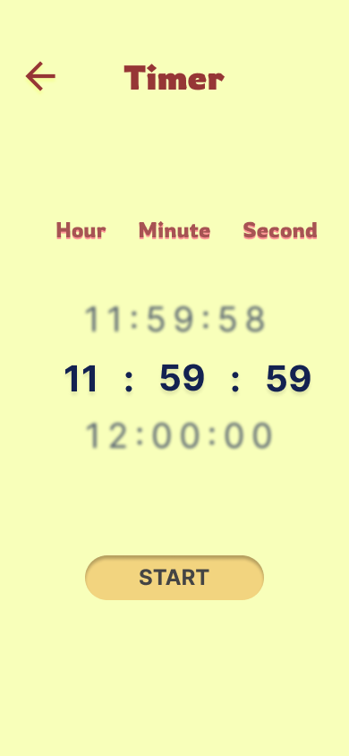
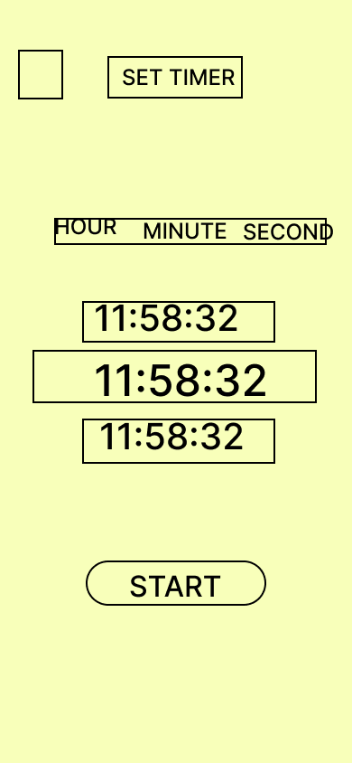
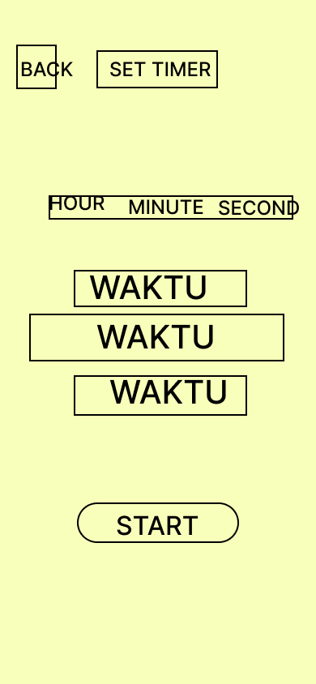

# TugasPertemuanKe7MataKuliahPemrogramanMobile2
# Bagas Prihantoro Putra 312310599 Timer WIth Navbar

{
  "version": 3,
  "artifactType": {
    "type": "APK",
    "kind": "Directory"
  },
  "applicationId": "com.example.mytimer",
  "variantName": "debug",
  "elements": [
    {
      "type": "SINGLE",
      "filters": [],
      "attributes": [],
      "versionCode": 1,
      "versionName": "1.0",
      "outputFile": "app-debug.apk"
    }
  ],
  "elementType": "File"
}
